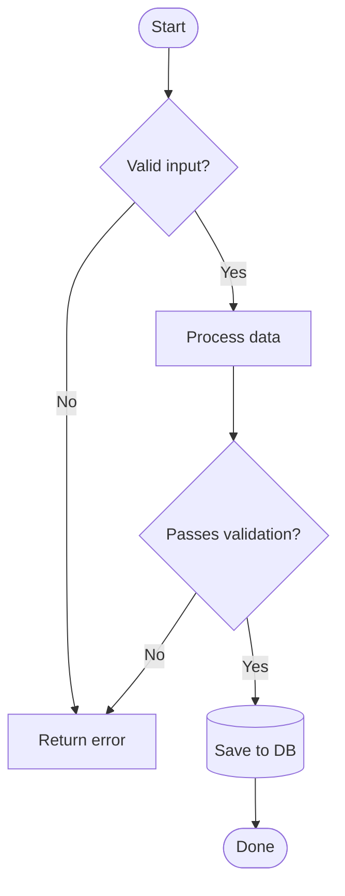
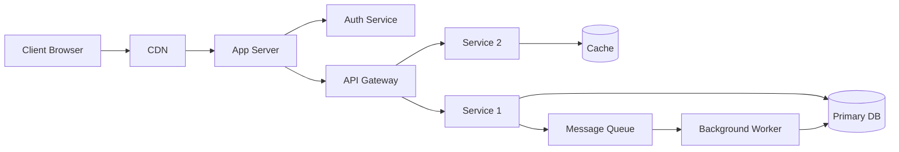
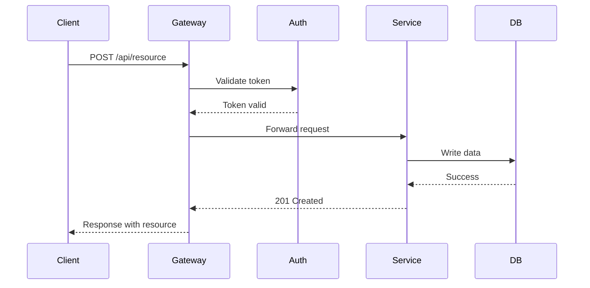
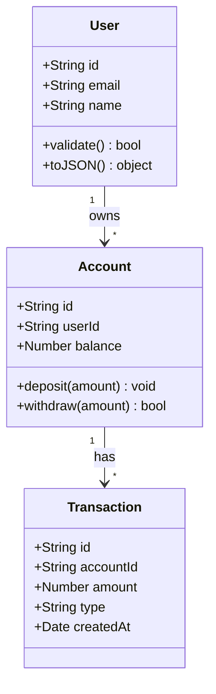
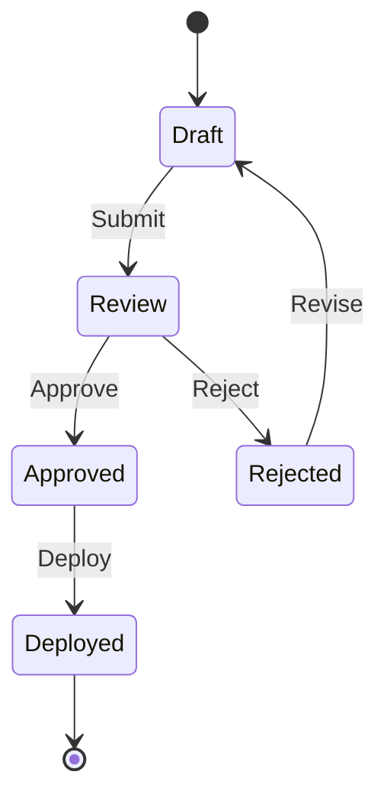
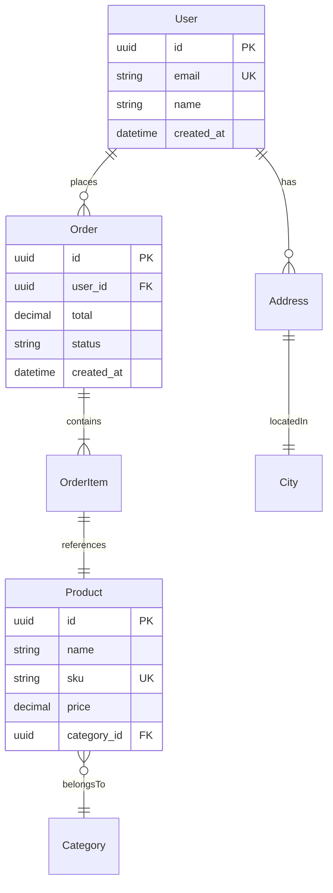
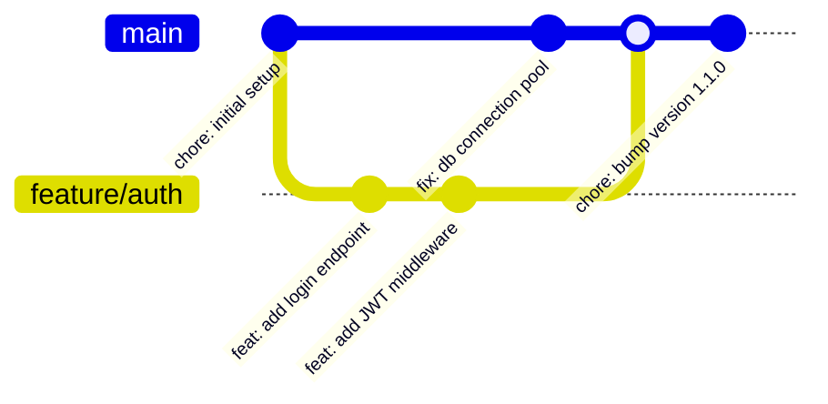
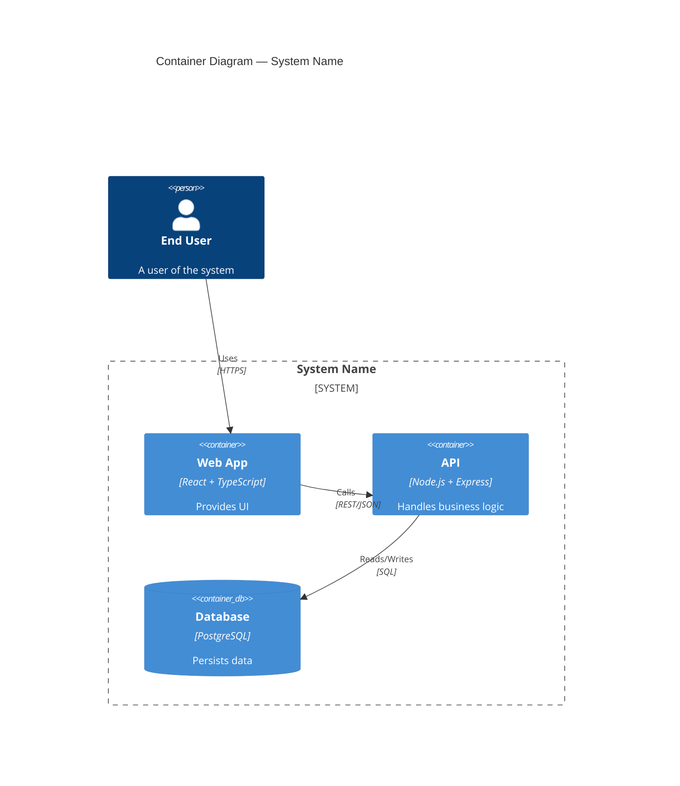

# Mermaid Diagram Patterns

## Flowchart — Process Flow (TD)

## Flowchart — Architecture (LR)

## Sequence Diagram — API Interaction

## Class Diagram — Domain Model

## State Diagram

## ER Diagram — Database Schema

## Git Graph

## C4 Container Diagram

