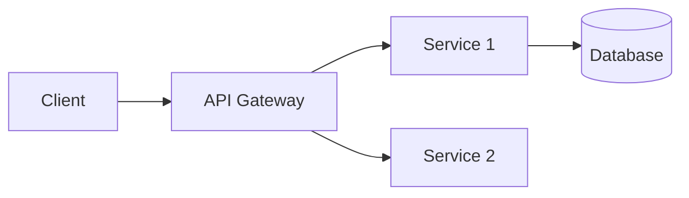

# Project Name

> One-line description of what the project does.

[](https://github.com/owner/repo/actions)
[](https://github.com/owner/repo/releases)
[](LICENSE)

## Overview

2-3 paragraphs describing:
- What problem this project solves
- Who should use it
- Key differentiators or philosophy

## Features

- Feature 1 — brief explanation
- Feature 2 — brief explanation
- Feature 3 — brief explanation

## Table of Contents

- [Installation](#installation)
- [Quick Start](#quick-start)
- [Usage](#usage)
- [API Reference](#api-reference)
- [Architecture](#architecture)
- [Contributing](#contributing)
- [License](#license)

## Installation

```bash
# Prerequisites
node >= 18
pnpm >= 8

# Install
pnpm install
```

## Quick Start

```bash
# Minimal example to get running
pnpm dev
```

Expected result: what the user should see.

## Usage

### Common Tasks

```
Task description → command to run → expected output
```

### Configuration

Environment variables or config file reference.

| Variable | Default | Description |
|---|---|---|
| `PORT` | `3000` | HTTP server port |

## API Reference

Link to full API docs or inline summary of main endpoints.

## Architecture



Brief architectural description.

## Contributing

See [CONTRIBUTING.md](CONTRIBUTING.md) for guidelines.

## License

[MIT](LICENSE) © Year Owner
