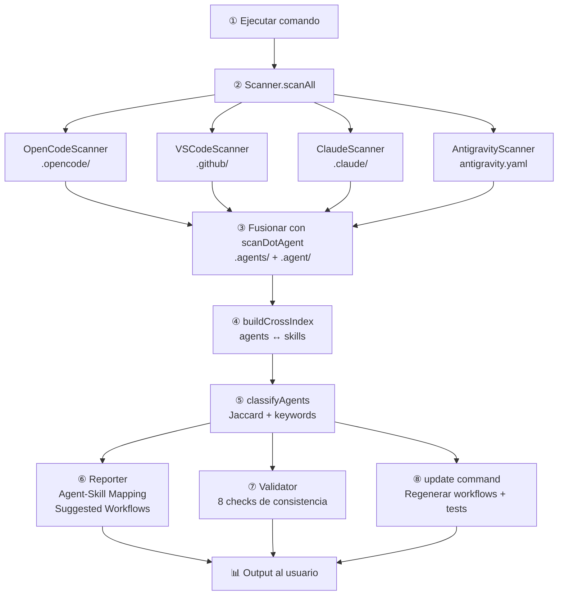

# Flujo de Detección de Skills y Agents Externos

## Descripción General

El sistema `tools_dynamic` escanea proyectos externos para detectar **agentes** y **skills** de forma automática. El flujo completo va desde la detección de plataforma hasta la clasificación por roles y la validación de consistencia.

```
Proyecto objetivo
      │
      ▼
┌─────────────────┐
│  Scanner.scan() │  ← Orquesta 4 detectores
└────────┬────────┘
         │
    ┌────┴────┬─────┬──────┐
    ▼         ▼     ▼      ▼
 OpenCode   VS Code Claude Antigravity
    │         │      │      │
    └────┬────┴─────┴──────┘
         ▼
┌─────────────────┐
│  buildCrossIndex│  ← Enlaza agentes ↔ skills
└────────┬────────┘
         ▼
┌─────────────────────────┐
│  classifyAgents()       │  ← Jaccard + keywords
└────────┬────────────────┘
         ▼
┌─────────────────┐   ┌────────────────┐
│  Reporter       │   │  Validator     │
│  (feedback)     │   │  (8 checks)    │
└─────────────────┘   └────────────────┘
```

---

## 1. Arquitectura del Scanner

### Scanner (Orquestador)

Archivo: `scanners/scanner.mjs`

La clase `Scanner` mantiene una lista priorizada de 4 detectores:

| Prioridad | Scanner | Plataforma |
|-----------|---------|------------|
| 1ª | `OpenCodeScanner` | `.opencode/`, `AGENTS.md`, `opencode.json` |
| 2ª | `VSCodeScanner` | `.github/copilot-instructions.md` |
| 3ª | `ClaudeScanner` | `CLAUDE.md`, `.claude/` |
| 4ª | `AntigravityScanner` | `antigravity.yaml`, `.agent/` |

Métodos principales:

- **`scan(basePath)`** — Ejecuta todos los detectores, retorna resultados detectados y no detectados.
- **`scanAll(basePath)`** — Retorna solo los resultados donde `detected === true`.
- **`scanPrimary(basePath)`** — Retorna el primer resultado detectado según la prioridad.

### Contrato de cada Scanner

Cada scanner implementa:

```js
detect(basePath)   // → boolean
scan(basePath)     // → { platform, agents[], skills[], workflows[], ... }
```

El resultado del scan incluye:

| Campo | Tipo | Descripción |
|---|---|---|
| `platform` | string | Nombre de la plataforma |
| `agents` | AgentDef[] | Lista de agentes detectados |
| `skills` | SkillDef[] | Lista de skills detectados |
| `workflows` | object[] | Workflows existentes |
| `existingTools` | string[] | Herramientas ya presentes |
| `nativeCapabilities` | object | Capacidades nativas (subagents, mcp, etc.) |
| `configPaths` | string[] | Rutas de configuración encontradas |

---

## 2. Detección de Agentes

### Desde el directorio nativo de la plataforma

Cada scanner parsea agentes de su directorio específico:

| Plataforma | Directorio de agentes |
|---|---|
| OpenCode | `.opencode/agents/*.md` |
| VS Code | `.github/agents/*.md` |
| Claude | `.claude/agents/*.md` |
| Antigravity | `antigravity.yaml` (definiciones YAML) |

El parseo usa `Parser.parseFrontmatter()` para extraer:

- `name` — del frontmatter o del nombre del archivo
- `mode` — `primary` o `subagent`
- `permissions` — `edit` y `bash` desde frontmatter
- `keywords` — de `TRIGGER KEYWORDS` en frontmatter
- `sections` — encabezados `##` del cuerpo del markdown
- `hasHandoff` — si el cuerpo contiene "Handoff Protocol"

### Desde `.agent/` y `.agents/` (híbrido universal)

La función `scanDotAgent(basePath)` en `core/parser.mjs` proporciona soporte **dual**:

1. Escanea `.agents/` primero (convención primaria).
2. Escanea `.agent/` después (retrocompatibilidad).

Dentro de cada directorio, reconoce tres subdirectorios:

```
.agents/                    # o .agent/
├── rules/                  # → Agentes (archivos .md) y Skills (subdirectorios con SKILL.md)
│   ├── database-agent.md   → agente
│   ├── testing/            → skill (contiene SKILL.md)
│   └── general.md          → agente
├── agents/                 # → Agentes (solo .md files)
│   └── specialist.md       → agente
└── skills/                 # → Skills (subdirectorios con SKILL.md)
    └── backend/
        ├── SKILL.md
        └── references/
```

Los agentes y skills detectados vía `scanDotAgent()` se **fusionan** con los del scan nativo, evitando duplicados por nombre.

---

## 3. Detección de Skills

### Parseo desde directorio

`parseSkillFromDir(skillDir)` en `core/parser.mjs` lee `SKILL.md` y extrae:

| Campo | Fuente |
|---|---|
| `name` | `frontmatter.name` o nombre del directorio |
| `keywords` | `frontmatter.TRIGGER KEYWORDS` |
| `filePath` | Ruta al archivo `SKILL.md` |
| `references` | Archivos `.md` en `references/` |
| `role` | `frontmatter.role` (para clasificación explícita) |

### Skills por plataforma

| Plataforma | Directorio de skills |
|---|---|
| OpenCode | `.opencode/skills/<name>/SKILL.md` |
| VS Code | `.github/skills/<name>/SKILL.md` |
| Claude | `.claude/skills/<name>/SKILL.md` |
| Antigravity | `antigravity.yaml` o `.agent/rules/<name>/SKILL.md` |

---

## 4. Cross-Index (Vinculación Bidireccional)

Después de recolectar agentes y skills, `buildCrossIndex(agents, skills)` en `core/parser.mjs` crea enlaces en ambas direcciones:

1. Por cada skill, pobla `skill.agents[]` con los nombres de agentes que la referencian.
2. Por cada agente, pobla `agent.skills[]` con los nombres de skills que lo referencian.

Esto permite:

- Desde un agente: saber qué skills domina.
- Desde un skill: saber qué agentes pueden ejecutarlo.

La vinculación usa `_skillRefs` extraídos del frontmatter del agente (campos `skills[]` o `paths[]`), resueltos por nombre contra el map de skills.

---

## 5. Clasificación por Roles (Skill-Aware)

Una vez construido el cross-index, `WorkflowGenerator.classifyAgents(agents, skills)` asigna un rol a cada agente.

### Algoritmo

```
1. ¿El agente tiene skills?
   │
   ├── Sí → ¿El skill tiene role explícito?
   │        ├── Sí → Usar ese rol (confianza 100%)
   │        └── No → Jaccard similarity vs ROLE_PROFILES
   │                 └── ¿Score ≥ 5%?
   │                      ├── Sí → Rol con mayor similitud
   │                      └── No → classified: false
   │
   └── No → Fallback por keywords del agente
            (regex sobre TRIGGER KEYWORDS y nombre)
```

### Perfiles de Roles

Definidos en `core/role-profiles.mjs`:

| Rol | Keywords representativas |
|---|---|
| `reviewer` | review, security, quality, audit, performance, lint |
| `writer` | doc, readme, changelog, apidoc, migration, tutorial |
| `tester` | test, spec, coverage, unittest, jest, pytest, assert |
| `builder` | database, api, backend, frontend, docker, deploy, schema |

### Jaccard Similarity

```js
jaccardSimilarity(setA, setB) = |A ∩ B| / |A ∪ B|
```

- Sets idénticos → 1.0
- Sets disjuntos → 0.0
- Ambos vacíos → 1.0
- Solo uno vacío → 0.0

### Metadatos de Clasificación

Por cada agente se almacena en `_classificationMap`:

```js
{
  role: 'reviewer',        // Rol asignado
  confidence: 0.35,        // Score de similitud
  method: 'jaccard',       // 'explicit' | 'jaccard' | 'keyword' | 'fallback'
  classified: true,        // ¿Pudo clasificarse?
  skillName: 'testing',    // Skill usado (si aplica)
}
```

---

## 6. Validación Post-Scan

El `Validator` en `core/validator.mjs` ejecuta 8 chequeos de consistencia:

| # | Chequeo | Severidad | Detecta |
|---|---|---|---|
| 1 | Skills huérfanos | 🟡 warning | Skills no referenciados por ningún agente |
| 2 | Referencias rotas | 🔴 blocker | Agentes que referencian skills inexistentes |
| 3 | Subagentes sin skills | 🟡 warning | Subagentes sin `skills[]` en frontmatter |
| 4 | Workflow agents desaparecidos | 🟡 warning | Workflows que referencian agentes ya eliminados |
| 5 | Keyword-skill mismatch | ℹ️ info | Skills con baja confianza de clasificación |
| 6 | Agentes no clasificados | ℹ️ info | Agentes que no se pudieron asignar a ningún rol |
| 7 | Baja confianza (< 30%) | ℹ️ info | Agentes clasificados con score muy bajo |
| 8 | Deriva cross-platform | 🟡 warning | Skills con mismo nombre pero distinto contenido entre plataformas |

---

## 7. Reporter y Feedback Post-Scan

El `Reporter` en `core/reporter.mjs` consume los resultados del scan y produce:

- **Agent-Skill Mapping** — Cuántos agentes tienen skills, cuántos skills son referenciados, agentes no clasificados.
- **Suggested Workflows** — Workflows sugeridos basados en los roles detectados, con porcentaje de confianza.
- **Next Steps** — Sugerencias accionables (ejecutar `validate`, `doctor`, etc.).

Integrado en los comandos: `analyze`, `init`, `inject`.

---

## 8. Comandos que Usan el Scanner

| Comando | Flujo |
|---|---|
| `analyze` | Scan → Reporter (print) |
| `report` | Scan → Reporter (JSON/HTML) |
| `doctor` | Scan → Reporter (diagnóstico + VanillaDetector) |
| `validate` | Scan → Validator (8 checks) |
| `update` | Scan → Injector.regenerateWorkflows() → diff → backup → write |
| `init` | Scan → Reporter (feedback) → Injector.plan() → Injector.execute() |
| `inject` | Scan → Injector.plan() → Injector.execute() |

---

## 9. Diagrama de Flujo Completo



---

## Archivos Clave

| Archivo | Propósito |
|---|---|
| `scanners/scanner.mjs` | Orquestador de detectores |
| `scanners/opencode-scanner.mjs` | Detector OpenCode |
| `scanners/vscode-scanner.mjs` | Detector VS Code |
| `scanners/claude-scanner.mjs` | Detector Claude |
| `scanners/antigravity-scanner.mjs` | Detector Antigravity |
| `core/parser.mjs` | `parseAgentFromMd()`, `parseSkillFromDir()`, `scanDotAgent()`, `buildCrossIndex()` |
| `core/types.mjs` | Definiciones `AgentDef`, `SkillDef` |
| `core/role-profiles.mjs` | `ROLE_PROFILES`, `jaccardSimilarity()`, `classifyBySkill()` |
| `core/workflow-generator.mjs` | `classifyAgents()`, generación de workflows |
| `core/validator.mjs` | 8 checks de validación |
| `core/reporter.mjs` | Post-scan feedback y visualización |
| `core/injector.mjs` | `regenerateWorkflows()`, planificación e inyección |

---

*Modelo: opencode/deepseek-v4-flash-free*
