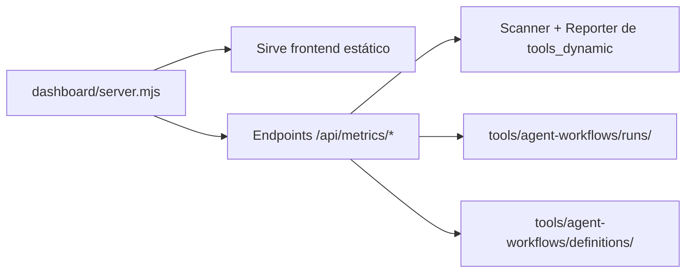

# v2 — Cleanup, Dashboard Improvement & Integration Roadmap

> **Nombre clave:** `roadmap_v2_cleanup_dashboard.md`
> **Versión:** 2.2
> **Estado:** ⏳ Planificado
> **Última revisión:** 2026-05-23

## Visión General

Tres objetivos para dejar el repo listo para seguir desarrollando `tools_dynamic`:

1. **Limpieza del proyecto** — Eliminar artefactos generados, archivos huérfanos, docs obsoletos. Dejar solo lo necesario para git.
2. **Mejorar el dashboard** — Reemplazar backend .NET por Node.js (usa el scanner de tools_dynamic), mostrar datos reales con plataformas, modelos, health en vivo.
3. **Integrar dashboard en tools_dynamic** — Agregar `dashboard` como componente seleccionable en `init`/`inject`.

---

## Fase 1 — Limpieza del proyecto

**Objetivo:** El repo solo contiene código fuente + templates + docs esenciales. Nada generado.

### 1.1 Eliminar directorios y archivos huérfanos

| Elemento | Acción | Motivo |
|----------|--------|--------|
| `.antigravitycli/` | Eliminar | Vacío, sin propósito |
| `.opencode/plans/` | Mover a `Docs/archive/plans/` | Son planes de implementación viejos, no config de opencode |
| `tools/` | Agregar a `.gitignore` + `git rm --cached` si está trackeado | Todo `tools/` es **generado** por `tools-dynamic init` desde templates. No se trackea. |
| `tools/agent-metrics/reports/*.json` | Agregar a `.gitignore` | Reportes generados, no deben trackearse |
| `tools/agent-workflows/runs/*.json` | Confirmar que `.gitignore` ya lo cubre | Ya está en `.gitignore` |

### 1.2 Archivar documentación histórica

Mover a `Docs/archive/` los siguientes planes que ya están cubiertos por `FASE-2-Fixes.md` + roadmaps:

- `Docs/FASE-0-Integrar.md`
- `Docs/FASE-1.md`
- `Docs/FASE-2.md`
- `Docs/Fase-Estabilizacion.md`
- `Docs/implementation_plan_v2x.md`

### 1.3 Actualizar `.gitignore`

```
# Generated tools directory (created by tools-dynamic init/inject)
tools/

# Metrics reports (generated at runtime)
tools/agent-metrics/reports/*.json

# .NET build artifacts
dashboard/backend/Dashboard.Api/bin/
dashboard/backend/Dashboard.Api/obj/

# Workflow runtime state
tools/agent-workflows/runs/*.json
!tools/agent-workflows/runs/.gitkeep

# OS files
Thumbs.db
.DS_Store

# IDE
.idea/
.vs/
*.sln.ide/
```

### 1.4 Commit final de limpieza

```bash
git add -A
git commit -m "chore: cleanup project — remove generated artifacts, archive old docs"
```

**Resultado F1:** `tools_dynamic/`, `dashboard/` (src), `Docs/` (esencial), `.opencode/`, `AGENTS.md`, `README.md`. Nada generado.

---

## Fase 2 — Mejorar el dashboard

**Problema actual:**
- Backend es .NET 10 (`Dashboard.Api/`) — requiere SDK, difícil de ejecutar
- Lee de `tools/agent-metrics/reports/latest.json` — formato legacy, paths hardcodeados a `.opencode/agents`
- Solo funciona con plataforma opencode
- No muestra `model`, `platform`, `filePath` del scanner

**Solución:** Reemplazar backend .NET por servidor Node.js que usa el scanner de `tools_dynamic` directamente.

### 2.1 Crear servidor Node.js (`dashboard/server.mjs`)



Endpoints:

| Endpoint | Descripción | Fuente |
|----------|-------------|--------|
| `GET /api/metrics/summary` | Health general, counts, pass rates | Scanner + Reporter |
| `GET /api/metrics/agents` | Agentes con modelo, alerts, platform | Scanner |
| `GET /api/metrics/skills` | Skills con sync status | Scanner |
| `GET /api/metrics/alerts` | Alertas activas | Reporter.diagnose() |
| `GET /api/metrics/platforms` | **Nuevo**: plataformas detectadas | Scanner |
| `GET /api/metrics/workflows/runs` | Workflow runs recientes | tools/ dir |
| `GET /api/metrics/workflows/definitions` | Definiciones disponibles | tools/ dir |

### 2.2 Mejorar frontend (`dashboard/frontend/`)

Partiendo del frontend actual (vanilla JS + Chart.js), agregar:

**Nueva sección: Platforms**
- Tarjetas por plataforma detectada: nombre, health, cantidad de agents/skills, versión
- Color badge por plataforma

**Tarjetas de agente mejoradas**
- Mostrar `[model: nombre]` con badge de color
- Mostrar `filePath` (ruta real del .md)
- Mostrar `platform` a la que pertenece
- Mantener health color (🟢/🟡/🔴)

**Skills table mejorada**
- Agregar columna "Platform"
- Agregar columna "Model" (si aplica)
- Mantener sync status, keywords, goal, references

**Gráficos adicionales**
- Distribución de plataformas (doughnut)
- Alertas por severidad (bar chart)
- Agentes por plataforma (bar chart)

### 2.3 Eliminar backend .NET

Una vez que `dashboard/server.mjs` funciona:

```bash
git rm -r dashboard/backend/Dashboard.Api/
```

### 2.4 Actualizar docs del dashboard

`Docs/processes/tools-dynamic/dashboard.md` → reflejar:
- Nueva arquitectura Node.js
- Nuevos endpoints
- Sin dependencia de .NET SDK

### 2.5 Uso del dashboard mejorado

```bash
# Desde la raíz del proyecto
node dashboard/server.mjs
# Abrir http://localhost:5071
```

Sin dependencias externas. El server usa `http` nativo de Node.js.

**Resultado F2:** Dashboard 100% Node.js, datos en vivo del scanner, muestra platforms + model + health real.

---

## Fase 3 — Integrar dashboard en `tools_dynamic`

**Objetivo:** El usuario puede seleccionar "Dashboard" como componente en `init`/`inject`, igual que testing, metrics, workflows, etc.

### 3.1 Template del dashboard

Crear `tools_dynamic/templates/tools/dashboard/`:

```
tools_dynamic/templates/tools/dashboard/
├── server.mjs                    # → tools/dashboard/server.mjs
├── frontend/
│   ├── index.html                # → tools/dashboard/frontend/index.html
│   ├── css/
│   │   └── styles.css            # → tools/dashboard/frontend/css/styles.css
│   └── js/
│       └── app.js                # → tools/dashboard/frontend/js/app.js
```

> **Nota:** Estos templates son copia del `dashboard/` mejorado (Fase 2), pero con variables `{{agentsDir}}`, `{{skillsDir}}`, `{{platformDir}}` para que funcionen en cualquier proyecto.

### 3.2 Agregar opción en component prompt (`index.mjs`)

En el selector de componentes del comando `init` (línea ~237), agregar:

```js
{ name: '📊 Dashboard (visualization panel)', value: 'dashboard', checked: false },
```

Aparece después de `context` y antes del separador + `__exit__`.

### 3.3 Agregar `--dashboard` flag en `inject` (`index.mjs`)

```js
.option('--dashboard', 'Inject dashboard panel')
```

Y en la lógica de detección de flags específicos:

```js
const hasSpecific = options.agents || options.skills || options.platformConfig 
  || options.config || options.tools || options.processes || options.context 
  || options.dashboard;
```

### 3.4 Modificar `injector.plan()` (`core/injector.mjs`)

Después del bloque `includeContext`, agregar:

```js
if (includeDashboard) {
  const toolDir = join('tools', 'dashboard');
  const files = this.listTemplates(toolDir);
  for (const file of files) {
    const content = this.loadTemplate(file.relativePath);
    if (content === null) continue;
    const substituted = this.substitute(content, variables);
    const targetFile = join('tools', 'dashboard', file.name);
    plan.directories.push('tools/dashboard/');
    plan.create.push({ path: targetFile, content: substituted });
  }
}
```

Nota: Para los archivos dentro de `frontend/`, usar `listTemplates` con subdirectorios o un helper similar a `listTemplatesNested`.

### 3.5 Actualizar flags combinados

- `--all` debe incluir `dashboard`
- `--tools` sugerencia: `dashboard` es independiente de `--tools` (es UI, no tool interna)
- `--config` NO incluye `dashboard`

### 3.6 Tests

| Test | Descripción |
|------|-------------|
| `plan()` con `dashboard` | Verificar que `plan.create` incluye archivos de dashboard |
| `plan()` sin `dashboard` | Verificar que NO incluye archivos de dashboard |
| `plan()` con `--all` | Verificar que dashboard está incluido |
| Inject con `--dashboard` | Simular inject y verificar archivos creados |
| server.mjs arranca | Test de integración: iniciar server, consultar endpoints |

### 3.7 Comportamiento esperado

| Escenario | Resultado |
|-----------|-----------|
| `init` + seleccionar Dashboard | Crea `tools/dashboard/` con server + frontend |
| `inject . --dashboard` | Crea solo `tools/dashboard/` |
| `inject . --all` | Crea todo incluyendo dashboard |
| `inject .` (sin flags) | Crea todo incluyendo dashboard |
| `doctor .` | No cambios (dashboard no afecta diagnóstico) |
| `analyze .` | No muestra dashboard como plataforma (no lo es) |

**Resultado F3:** Dashboard es un componente más de tools_dynamic, opcional, seleccionable en init/inject.

---

## Resumen de archivos

### CREAR

| Archivo | Fase |
|---------|------|
| `docs/archive/` | F1 |
| `dashboard/server.mjs` | F2 |
| `tools_dynamic/templates/tools/dashboard/server.mjs` | F3 |
| `tools_dynamic/templates/tools/dashboard/frontend/index.html` | F3 |
| `tools_dynamic/templates/tools/dashboard/frontend/css/styles.css` | F3 |
| `tools_dynamic/templates/tools/dashboard/frontend/js/app.js` | F3 |

### MODIFICAR

| Archivo | Cambio | Fase |
|---------|--------|------|
| `.gitignore` | Agregar `tools/`, `tools/agent-metrics/reports/*.json` | F1 |
| `dashboard/frontend/js/app.js` | Mostrar model, platform, filePath, nuevas secciones | F2 |
| `dashboard/frontend/index.html` | Agregar sección Platforms, mejorar layout | F2 |
| `dashboard/frontend/css/styles.css` | Estilos para nuevas secciones | F2 |
| `Docs/processes/tools-dynamic/dashboard.md` | Nueva arquitectura Node.js | F2 |
| `tools_dynamic/index.mjs` | Agregar `dashboard` en choices + `--dashboard` flag | F3 |
| `tools_dynamic/core/injector.mjs` | Agregar `includeDashboard` en `plan()` | F3 |
| `tools_dynamic/commands/inject.mjs` | Manejar `--dashboard` | F3 |

### ELIMINAR

| Archivo | Fase |
|---------|------|
| `.antigravitycli/` | F1 |
| `dashboard/backend/Dashboard.Api/` (completo) | F2 |
| `Docs/FASE-0-Integrar.md` (→ archive/) | F1 |
| `Docs/FASE-1.md` (→ archive/) | F1 |
| `Docs/FASE-2.md` (→ archive/) | F1 |
| `Docs/Fase-Estabilizacion.md` (→ archive/) | F1 |
| `Docs/implementation_plan_v2x.md` (→ archive/) | F1 |

---

## Criterios de aceptación

- [ ] `git status` muestra solo archivos fuente + templates + docs esenciales
- [ ] `tools/` completo está en `.gitignore` y no se trackea
- [ ] Todos los tests existentes pasan (190): `node --test tools_dynamic/tests/*.test.mjs`
- [ ] Dashboard Node.js arranca sin dependencias externas
- [ ] Dashboard muestra platforms detectadas con datos reales del scanner
- [ ] Dashboard muestra `model` por agente
- [ ] `init` tiene opción "Dashboard" en component prompt
- [ ] `inject . --dashboard` crea `tools/dashboard/` correctamente
- [ ] `inject . --all` incluye dashboard
- [ ] Tests nuevos para dashboard component pasan

---

## Orden de ejecución

```
Fase 1 (Limpieza)
  └── Fase 2 (Dashboard mejorado)
       └── Fase 3 (Integración en tools_dynamic)
```

Cada fase es independiente y commitiable por separado.

---

*Modelo: opencode/deepseek-v4-flash-free*
